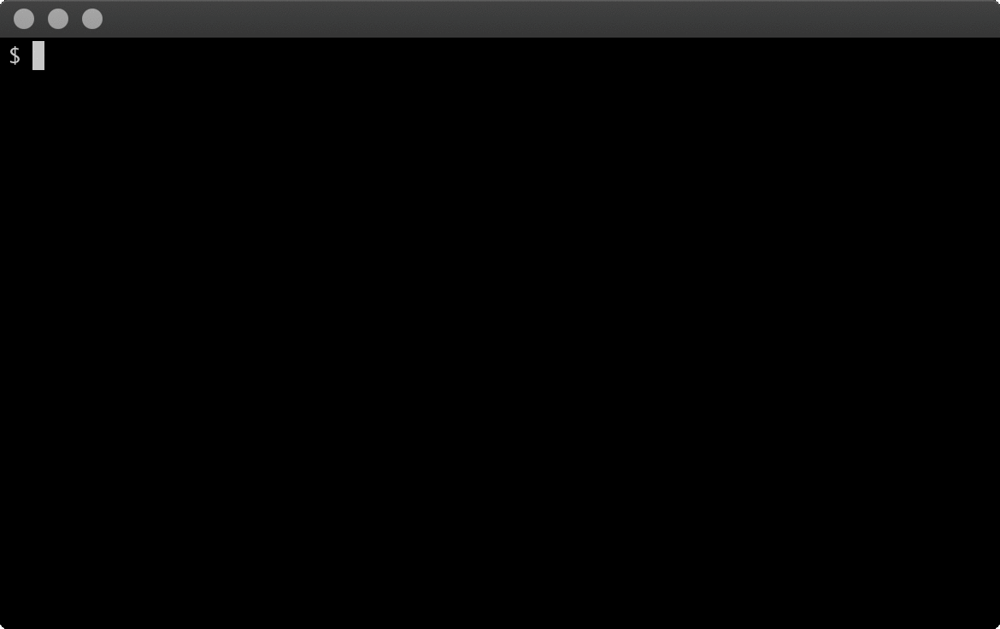

# beoplay-cli

This is an unofficial command line interface (CLI) for macOS to remote control network enabled Beoplay loudspeakers.

This repository contains:
- [Device Emulator](https://github.com/tlk/beoplay-macos-remote-cli/tree/master/Sources/Emulator): announces itself on the network (zeroconf/bonjour) and supports volume adjustments
- [RemoteCore](https://github.com/tlk/beoplay-macos-remote-cli/tree/master/Sources/RemoteCore): device discovery (zeroconf/bonjour), notification module (event based, auto reconnect)
- [RemoteCLI](https://github.com/tlk/beoplay-macos-remote-cli/tree/master/Sources/RemoteCLI): command line interface, using the RemoteCore library.

The RemoteCore library is also used by https://github.com/tlk/beoplay-macos-remote-gui which supports keyboard shortcuts.


## Usage

#### Interactive mode with hints and tab-completion


#### Non-interactive mode
```
$ beoplay-cli discover
+ "Beoplay Device"	http://BeoplayDevice.local.:8080

$ export BEOPLAY_NAME="Beoplay Device"
$ beoplay-cli getVolume
35
$ beoplay-cli setVolume 20
$ beoplay-cli getVolume
20
$ beoplay-cli pause
$ beoplay-cli play
$ beoplay-cli monitor
RemoteCore.NotificationBridge.DataConnectionNotification(state: RemoteCore.NotificationSession.ConnectionState.connecting, message: nil)
RemoteCore.NotificationBridge.DataConnectionNotification(state: RemoteCore.NotificationSession.ConnectionState.online, message: nil)
RemoteCore.Source(id: "radio:2714.1200304.28096178@products.bang-olufsen.com", type: "TUNEIN", category: "RADIO", friendlyName: "TuneIn", productJid: "2714.1200304.28096178@products.bang-olufsen.com", productFriendlyName: "Beoplay M5 i køkkenet", state: RemoteCore.DeviceState.play)
RemoteCore.NowPlayingRadio(stationId: "s37309", liveDescription: "Higher Love - Kygo & Whitney Houston", name: "96.5 | DR P4 København (Euro Hits)")
RemoteCore.Progress(playQueueItemId: "plid-4342.3", state: RemoteCore.DeviceState.play)
RemoteCore.Volume(volume: 35, muted: false, minimum: 0, maximum: 90)
RemoteCore.Progress(playQueueItemId: "plid-4342.3", state: RemoteCore.DeviceState.play)
RemoteCore.Progress(playQueueItemId: "plid-4342.3", state: RemoteCore.DeviceState.play)
RemoteCore.Progress(playQueueItemId: "plid-4342.3", state: RemoteCore.DeviceState.play)

RemoteCore.NotificationBridge.DataConnectionNotification(state: RemoteCore.NotificationSession.ConnectionState.disconnecting, message: nil)
RemoteCore.NotificationBridge.DataConnectionNotification(state: RemoteCore.NotificationSession.ConnectionState.offline, message: nil)
$
$ beoplay-cli monitor volume
RemoteCore.Volume(volume: 23, muted: false, minimum: 0, maximum: 90)
RemoteCore.Volume(volume: 27, muted: false, minimum: 0, maximum: 90)
RemoteCore.Volume(volume: 31, muted: false, minimum: 0, maximum: 90)
RemoteCore.Volume(volume: 35, muted: false, minimum: 0, maximum: 90)

$ beoplay-cli emulator "Nice Device"
emulating device "Nice Device" on port 80  (stop with ctrl+c)
^C
$
```


## Installation

```
$ make install
swift build -c release
[5/5] Linking ./.build/x86_64-apple-macosx/release/beoplay-cli
cp .build/release/beoplay-cli /usr/local/bin/beoplay-cli
$ 
```


## Configuration

The beoplay-cli tool needs to know which device to connect to when issuing commands such as play, pause, etc.

Beoplay devices on the local network can be discovered in different ways:
- [Discovery.app](https://apps.apple.com/us/app/discovery-dns-sd-browser/id1381004916?mt=12)
- `dns-sd -B _beoremote._tcp.`
- `beoplay-cli discover`

The device name can be specified via an environment variable:
```
$ export BEOPLAY_NAME="Beoplay Device"
$ beoplay-cli play
```

Alternatively, host and port can be used:
```
$ export BEOPLAY_HOST=BeoplayDevice.local.
$ export BEOPLAY_PORT=8080
$ beoplay-cli play
```


## Related Projects
- macOS menu bar, keyboard shortcuts and auto discovery: https://github.com/tlk/beoplay-macos-remote-gui
- Home Assistant plugin: https://github.com/martonborzak/beoplay-custom-component
- Homebridge plugin: https://github.com/connectjunkie/homebridge-beoplay
- Python web server with auto discovery: https://github.com/mtlhd/beowebmote
